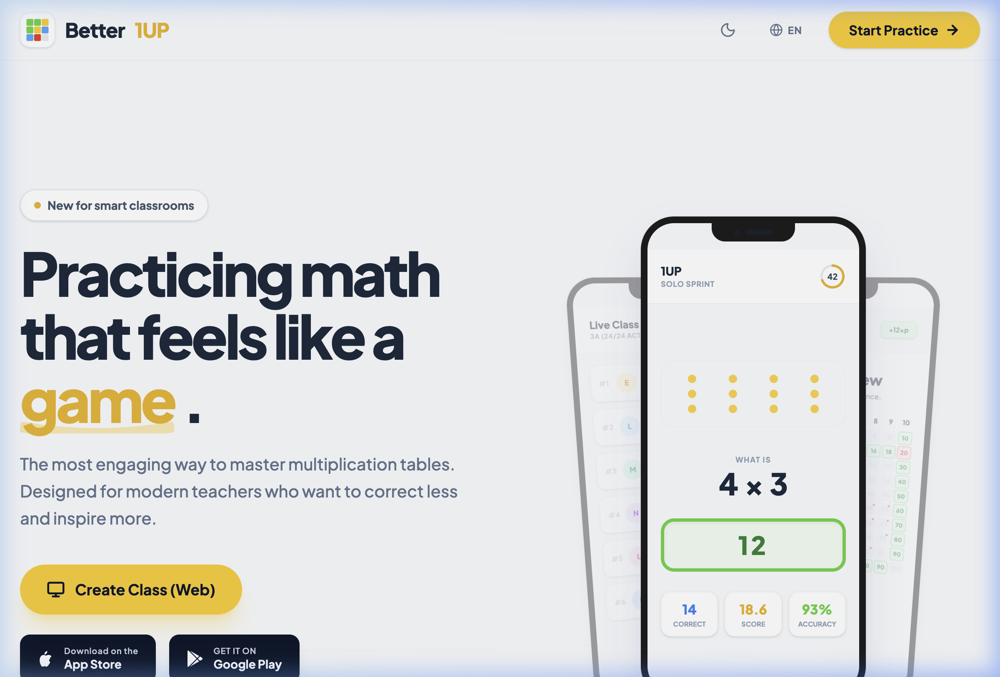

<div align="center">
  
  
  <br/><br/>
  
  <h1>Better 1UP </h1>
  <p><b>Real-time multiplayer multiplication trainer. Adaptive problem selection, difficulty-weighted scoring, live sync via SpaceTimeDB.</b></p>

  <a href="https://better-1up.vercel.app"></a>
  <a href="https://better1up.vercel.app"></a>
  <br/><br/>


  
  
  
  

</div>

<br/>

## Overview

Better 1UP is a high-speed, adaptive multiplication trainer. It features a UI that offers tactile feedback, progressive web app (PWA) mobile support, and seamless multiplayer synchronization.

---


## Features

**Sprint (60 s)**
- Adaptive selection: `p(appear) ∝ difficulty_weight × (1.5 − last10_accuracy)`
- Score = Σ difficulty weights of correct answers; wrong answer = −2 s penalty
- **Modality Multiplier**: Typed answers (Type Mode) award 3.0x points relative to Multiple-Choice (Tap Mode) to incentivize mental exertion.
- **Teacher Telemetry**: Teachers can focus on a student in the Live Class view to stream their keystrokes/taps in real time.
- Tier-gated pool: only unlocked pairs appear until mastery gates open the next tier

**Learning tiers** (unlocked automatically at end of session)
| Tier | Unlocks | Unlock condition |
|------|---------|-----------------|
| 0 | ×1 ×2 ×10 | automatic |
| 1 | +×3 | 80%* of tier-0 pairs mastered |
| 2 | +×5 | 80%* of tier-1 pairs mastered |
| 3 | +×4 | 80%* of tier-2 pairs mastered |
| 4 | +×6 | 80%* of tier-3 pairs mastered |
| 5 | +×7 | 80%* of tier-4 pairs mastered |
| 6 | +×8 | 80%* of tier-5 pairs mastered |
| 7 | +×9 | 80%* of tier-6 pairs mastered |

\* Speed bonus: if ≥80% of sprint answers for current-tier pairs are <2 s, threshold drops to 50%.

**Mastery grid** — heatmap of all answered ordered pairs (4×6 and 6×4 tracked separately)

**Difficulty weights** — bootstrapped from Ashcraft research; auto-updated after 20+ community answers:
`weight = 0.2 + 1.8×error_rate + 0.5×(avg_ms/10s)`

**Classrooms** — teacher creates class (6-char code + QR), live leaderboard + aggregate mastery grid

**Accounts** — no passwords; SpaceTimeDB token in localStorage; transfer code + recovery key for device migration

## Tech stack

- **Backend**: SpaceTimeDB — Rust module on maincloud
- **Frontend**: Vite + React 19 + TypeScript on Vercel
- **No external database** — SpaceTimeDB is the only data store

## Running locally

```bash
# Start local SpaceTimeDB
spacetime start

# Build and publish the server module
cd server
~/.cargo/bin/cargo build --target wasm32-unknown-unknown --release
spacetime publish spacetimemath --server local --bin-path target/wasm32-unknown-unknown/release/spacetimemath.wasm

# Generate TypeScript bindings
spacetime generate --lang typescript --out-dir ../client/src/module_bindings \
  --bin-path target/wasm32-unknown-unknown/release/spacetimemath.wasm

# Start frontend (client/.env.local already points to ws://127.0.0.1:3000)
cd ../client && npm install && npm run dev
```

## Publishing to maincloud

Use the Makefile from the repo root:

```bash
make publish    # build WASM + publish to maincloud (non-interactive)
make generate   # regenerate client/src/module_bindings from server source
make deploy     # publish + generate + run integration tests (full gate)
make call REDUCER=migrate_seed_best_scores   # call any reducer
```

Schema changes (adding columns) require `--break-clients` — disconnects all clients until they reload.

> **Why not just `spacetime publish` directly?** The CLI invokes cargo internally but won't find it unless `~/.cargo/bin` is in PATH — which it isn't in non-login shells. The Makefile uses absolute paths for both binaries to avoid this.

## Security design — "public result tables"

SpacetimeDB lets you mark a table as **private** so its rows are never sent to other clients. This is how `recovery_keys` and `transfer_codes` are protected.

However, **SpacetimeDB 2.0.3 has a limitation: private tables cannot push new rows to a subscriber.** The client can't receive a row that was just written for it by a reducer.

To work around this, four "result" tables are marked `public` instead of private:

| Table | Holds | Lifetime |
|-------|-------|----------|
| `recovery_code_results` | Player's own 12-char recovery code | Until the player calls `get_my_recovery_code` again |
| `restore_results` | Temporary auth token from account restore | Milliseconds — deleted after client reloads |
| `class_recovery_results` | All student codes for a classroom | Until teacher disconnects |
| `issued_problem_results` | Server-issued anti-cheat problem token | Until `submit_answer` consumes it |

**Why is this safe?**

- **No new information is exposed.** Recovery codes already live in the public `recovery_code_results` table from when they were created. `class_recovery_results` just re-packages the same codes for teacher printing — a malicious client subscribed to both tables would see the same codes either way.
- **The sensitive data exists for milliseconds.** `restore_results` holds an auth token only for the time between the server writing it and the client swapping it into `localStorage` and reloading. The row is deleted in `identity_disconnected` so it can never linger.
- **The real secrets stay private.** The `recovery_keys` table — which stores the actual long-lived secrets that tokens are derived from — remains strictly private and is never sent to any client.
- **Threat model fit.** This is a primary school app. The realistic threat is a student guessing a classmate's 12-character random code (36¹² ≈ 4.7 × 10¹⁸ combinations), not a sophisticated attacker monitoring raw WebSocket frames at the right millisecond.

When SpacetimeDB adds reliable private-table push in a future version, these four tables can be made private again without any other changes.

## iOS release pipeline

The app is published to the App Store as **Better 1UP** (`eu.bilharz.oneup`).

### Releasing a new version

```bash
git tag v1.0.1 && git push --tags
```

This triggers the GitHub Actions workflow (`ios-release.yml`) which:
1. Builds the React app and syncs it to the Xcode project via Capacitor
2. Fetches the distribution certificate + provisioning profile via **Fastlane Match** (`lbilharz/ios-certificates`)
3. Archives and signs the app with Xcode
4. Uploads the build to **TestFlight**

### Manual runs

From the **Actions** tab → **iOS Release** → **Run workflow**, pick a lane:

| Lane | What it does |
|------|-------------|
| `beta` | Build + upload to TestFlight only |
| `metadata` | Push store listing text + screenshots, no binary |
| `release` | Full: screenshots → metadata → build → submit for review |

### App Store screenshots

90 PNGs (9 languages × 2 device sizes × 5 screens) are generated via Playwright headless browser. The system is config-driven — adding a new screen means adding one entry to `client/src/screenshots/config.ts` and one React component in `client/src/screenshots/screens.tsx`.

```bash
cd client && npm run screenshots   # regenerate all 90 screenshots locally
```

### Required GitHub secrets

| Secret | Purpose |
|--------|---------|
| `ASC_API_KEY_ID` | App Store Connect API key ID |
| `ASC_API_KEY_ISSUER_ID` | App Store Connect issuer ID |
| `ASC_API_KEY_CONTENT` | Base64-encoded `.p8` key file |
| `MATCH_PASSWORD` | Passphrase to decrypt the certificates repo |
| `GH_PAT` | Fine-grained PAT with read access to `lbilharz/ios-certificates` |

---

## Project structure

```
server/src/lib.rs          Rust module: schema, reducers, tier logic
client/src/
  module_bindings/         Auto-generated TypeScript bindings (do not edit)
  pages/                   RegisterPage LobbyPage SprintPage ResultsPage
                           ResultsPage ClassroomPage AccountPage
  components/              MasteryGrid BottomNav TopBar DotArray
  utils/learningTier.ts    Client-side pair→tier mapping
```
